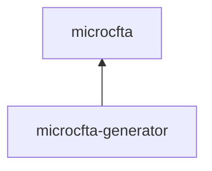

# microcfta

Constrained finite tree automata for Haskell, in two packages:

| Package | Purpose |
| --- | --- |
| [`microcfta`](microcfta/README.md) | One interned automaton engine with three constraint theories: ordinary tree automata, equality-constrained tree automata (ECTA), and liquid tree automata (LTA) with Liquid Fixpoint refinements and Z3 entailment. |
| [`microcfta-generator`](microcfta-generator/README.md) | Ranked generation, random sampling, replay, shrinking, and QuickCheck integration for all three. |



Concrete terms use `Data.Tree.Tree` from `containers`. The interned engine in
`Data.CFTA.Interned` has the types `Node symbol constraint` and
`Edge symbol constraint`, and `Data.CFTA` is the named-state view of the same
graph. Ordinary automata use `()`, equality-constrained automata use
`EqConstraints`, and liquid automata use `LiquidConstraint`. Interning,
recursive substitution, traversal, union, and structural intersection use the
same implementation. Each constraint theory interprets its own constraint:

- `Data.CFTA.Equality` propagates path equalities by reduction and solves them
  by unification during enumeration.
- `Data.CFTA.Refinement` prunes semantic guards by intersecting and splitting
  nodes along only the positions each guard inspects. The authoritative result
  remains an LTA. Residual positive equalities stay on its transitions as
  equality classes; constraints outside that fragment stay as guards.
- `Data.CFTA.Refinement.Guard` builds refinement-labelled transitions whose
  guards name the constructor arguments and use the paper's complete Boolean
  constraint language.

The semantic hierarchy is therefore concrete: an FTA has no constraints, an
ECTA has positive path equalities, and an LTA has the full Boolean equality and
entailment language. An automaton with no constraints is enumerated by the
plain level-by-level enumerator whatever layer built it.

`microcfta-generator` owns `Data.CFTA.Ranked`, which provides exact finite
ranks, backend-independent sampling, and shrinking. `Data.CFTA.Gen` compiles an
acyclic ordinary automaton or builds one with the `FTAGen.node`/`FTAGen.do`
syntax. `Data.CFTA.Gen.Equality` adds equality-constrained sources, equality
and relational joins, retained key groups, and recursive generation.
`Data.CFTA.Gen.Refinement` can retain the surface DSL's applicative structure,
ask the solver once per live tuple of refinement groups, and lower the accepted
tuples through indexed equality joins. Sampling is pure and does not enumerate
the Cartesian product. The DSL also supports finite Haskell pools and semantic
shrinking. The core package does not depend on the generator package or on
QuickCheck.

Run the ordinary and equality examples from the workspace root:

```sh
cabal run cfta-pairs
cabal run cfta-finite-languages
```

The ordinary and equality layers do not need a solver. Enter `nix-shell` to put
Z3 on `PATH`, then run the semantic entailment examples:

```sh
cabal run cfta-liquid-pairs
cabal run cfta-safe-division
cabal run cfta-automaton-interop
```

See [`docs/automata-syntax.md`](docs/automata-syntax.md) for the side-by-side
FTA, ECTA, and LTA construction forms and the rationale for the guard-lambda
syntax.

## Three flagship languages

The generator APIs close qualified-do child blocks consistently with
`FTAGen.node`, `ECTAGen.node`, and `LTAGen.node`. Three worked languages make
the added expressive power concrete:

| Automaton | Example | What becomes possible |
| --- | --- | --- |
| FTA | [`UntypedExpressionLanguage`](microcfta-generator/common/Data/CFTA/Gen/UntypedExpressionLanguage.hs) | Generate integer expression shapes. Every term has the one implicit sort. |
| ECTA | [`TypedExpressionLanguage`](microcfta-generator/common/Data/CFTA/Gen/TypedExpressionLanguage.hs) | Add integers and Booleans, then equate operation signatures with child result types. |
| LTA | [`StateMachineTraceLanguage`](microcfta-generator/common/Data/CFTA/Gen/Refinement/StateMachineTraceLanguage.hs) | Carry a typed operand stack from one command to the next and prove dependent input/output state contracts with Z3. |

The LTA example generates a complete QuickCheck trace before executing it, as
state-machine testing requires. `Push`, `Add`, `And`, `Equal`, `Not`, and `Pop`
are retained only when the previous trace's output stack is a subtype of the
next command's input space. The resulting trace is then replayed through both
an abstract model and a separate concrete interpreter.

Three smaller examples remain useful alongside that progression. The ECTA
[filesystem ownership join](microcfta-generator/test/Data/CFTA/Gen/Equality/GenSpec.hs)
shows flat equality conditioning, while
[`SafeBufferLanguage`](microcfta-generator/common/Data/CFTA/Gen/Refinement/SafeBufferLanguage.hs)
shows Z3 proving symbolic bounds and dependent append lengths before a partial
buffer interpreter reaches QuickCheck. The more LTA-biased
[`SizedVectorLanguage`](microcfta-generator/common/Data/CFTA/Gen/Refinement/SizedVectorLanguage.hs)
composes `append`, `take`, `zipWith`, and safe indexing through arithmetic
result-size refinements using the ordinary qualified-do syntax.

## Benchmarks

The core package has three benchmarks. `micro-bench` covers path lookup,
constraint construction, intersection, reduction, and constrained enumeration.
`enumeration-speed` times the shared enumerator on explicit-state and interned
automata. `cross-layer-speed` enumerates the same languages through the
ordinary, equality, and refinement layers so the three can be compared:

```sh
cabal bench microcfta:micro-bench --enable-optimization=2
cabal bench microcfta:enumeration-speed --enable-optimization=2
cabal bench microcfta:cross-layer-speed --enable-optimization=2
```

The three flagship languages are benchmarked against naive recognition and
ordinary handwritten generation. The trace table additionally includes a
QSM-style online generator and a hand-specialized rank decoder: the former
gives up global uniformity, while the latter establishes the ceiling for
bespoke code that duplicates the generic compiler. Exact-language comparisons
remain uniform at each depth or trace length; cells run in fresh processes,
include a cold first-sample measurement, and time out after 30 seconds. A
fourth control benchmark generates the typed-expression language with either
ECTA path equality or LTA integer-equality refinements, isolating the practical
cost of the liquid constraint theory. The measured tables and methodology live
in the
[`microcfta-generator` README](microcfta-generator/README.md#sampling-performance).

Generate the three flagship tables and the ECTA-versus-LTA control table from
the repository root with:

```sh
./scripts/benchmark-generators.sh
```

## Development

GHC 9.14 is the supported compiler series. The workspace selects GHC 9.14.1.
The packages require `base >=4.22 && <4.23` and `containers >=0.8 && <0.9`.
The test suites need `z3` on `PATH`; `nix-shell` provides it.

Build and test the whole workspace from the repository root:

```sh
cabal build all -j1
cabal test all -j1
```

CI also checks formatting and lint. Run the same checks locally with the
pinned `fourmolu.yaml` and `.hlint.yaml`:

```sh
fourmolu --mode check $(git ls-files '*.hs')
hlint --ignore-suggestions microcfta microcfta-generator
cabal-gild --mode check */*.cabal
```

The examples in the entry-point modules are executable. Run them with
[`doctest`](https://hackage.haskell.org/package/doctest):

```sh
cabal install doctest
cabal repl --with-repl=doctest lib:microcfta
cabal repl --with-repl=doctest lib:microcfta-generator
```

`scripts/release.sh PACKAGE --check-only` validates one package and the local
source archive of its workspace dependency. Publish `microcfta` first, then
`microcfta-generator`.

Code that imports `Data.CFTA.*` must declare `microcfta`, and code that imports
`Data.CFTA.Gen.*` or `Data.CFTA.Ranked.*` must declare `microcfta-generator`.
Code that imports `Data.Tree` directly must declare `containers`.
